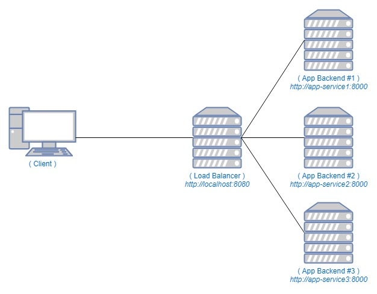

## Load Balancing Menggunakan Nginx
Load Balancing adalah sebuah mekanisme untuk membagi atau mendistribusikan trafik ke beberapa server.
Nginx selain berfungsi sebagai web server juga dapat digunakan sebagai Load Balancer.

## Metode Load Balancing
- Round Robin yaitu mendistribusikan trafik ke server secara bergantian.
- Least Connections yaitu mendistribusikan trafik ke server yang paling sedikit koneksi aktif.
- IP Hash yaitu mendistribusikan trafik ke server yang sama ketika visitor pertama kali melakukan request.

## Topologi Load Balancing


## Load Balancing Menggunakan Nginx Docker
Pada bagian ini, metode yang digunakan adalah ```Round Robin``` dimana trafik akan di distirbusikan secara bergantian
ke service app backend 1, app backend 2 dan app backend 3.

- ### Menjalankan Docker Container
  Sebelum menjalankan layanan ini pastikan sudah menginstall ```Docker Engine``` dan ```Docker Compose``` sebagai wadah virtualisasi container.

  Untuk menjalankan layanan ini secara keseluruhan ketikan perintah ini pada terminal.
  
  ```console
  docker-compose up -d
  ```

  Docker Compose sacara langsung akan membuat image pada masing - masing layanan (nginx, app backend 1, app backend 2, dan app backend 3) 
  dan menjalankannya menjadi sebuah ```container``` sesuai dengan layanan masing - masing. Dimana untuk layanan app backend 1, app backend 2 dan app backend 3 tidak terekspos keluar dan hanya dapat diakses dalam container network itu sendiri.

  Untuk mengakses load balancer melalui url ```http://localhost:8080```.

  Menonaktifkan Layanan.
  ```console
  docker-compose stop
  ```

  Mengaktifkan Layanan.
  ```console
  docker-compose start
  ```

  Menghapus Container.
  ```console
  docker-compose down
  ```

  Menghapus Container dan Images.
  ```console
  docker-compose down --rmi local
  ```

## Referensi
- https://musaamin.web.id/cara-setting-load-balancing-dengan-nginx/
- https://towardsdatascience.com/sample-load-balancing-solution-with-docker-and-nginx-cf1ffc60e644
